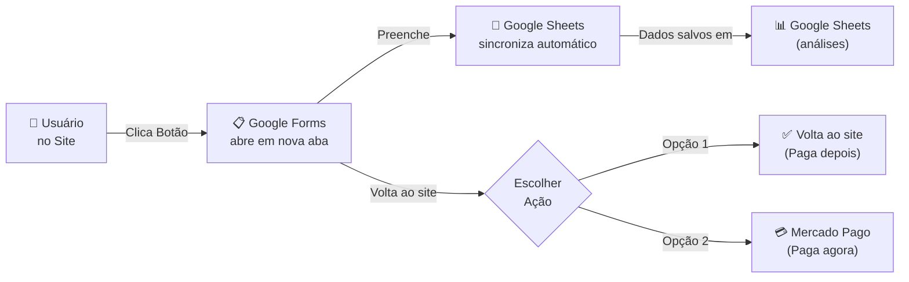

# Google Forms + Vercel Only - Setup Guide

## 📋 Arquitetura Atual (SEM BACKEND)

```
Frontend (Vercel)
    ↓
Google Forms (coleta de dados)
    ↓
Google Sheets (sincronização automática)
    ↓
Pagamento (Mercado Pago)
```

### Vantagens:
- ✅ SEM servidor backend (Google Forms é o servidor)
- ✅ Sem custo Render (use-o só quando crescer)
- ✅ Fácil de manter e atualizar
- ✅ Google Sheets automático para análises
- ✅ Escalável para banco de dados futuro

---

## 🔧 SETUP - 5 MINUTOS

### Passo 1: Configurar Google Form URL no Vercel

**1. Copie a URL do seu Google Form:**
- Abra seu formulário no Google
- Clique em "Enviar" (botão superior direito)
- Clique no ícone "Link" (corrente)
- Copie a URL completa

**2. Acesse Vercel Dashboard:**
- https://vercel.com/dashboard
- Selecione seu projeto `projeto-entre-amigas`
- Vá para **Settings** > **Environment Variables**

**3. Adicione a variável:**
```
Nome: REACT_APP_GOOGLE_FORM_URL
Valor: [copie a URL do seu Google Form]
Exemplo: https://docs.google.com/forms/d/e/1FAIpQLSd.../viewform
```

**4. Redeploy:**
- Clique em "Deployments"
- Clique no último deployment
- Clique em "Redeploy"
- Aguarde ~3-5 minutos

---

## 🧪 TESTAR LOCALMENTE

### Antes de Publicar

**1. Configurar `.env.local` no frontend:**

Crie arquivo `site-corrida/frontend/.env.local`:

```env
REACT_APP_GOOGLE_FORM_URL=https://docs.google.com/forms/d/e/1FAIpQLSd.../viewform
```

**2. Rodar localmente:**

```powershell
cd site-corrida/frontend
npm install
npm start
```

Acesso: `http://localhost:3000`

**3. Testar fluxo:**
- Clique no botão "Se inscreva você também!"
- Clique em "Abrir Google Forms"
- Preencha o formulário (não precisa enviar)
- Após 3 segundos, clique "Já Paguei" ou "Pagar com Mercado Pago"

---

## 🔄 FLUXO DE INSCRIÇÃO

### Fluxo Atual (Google Forms + Vercel)



### Vantagens desta Abordagem:
1. **Google Forms é responsável por:**
   - Coletar dados
   - Validar limite (100 pessoas)
   - Sincronizar com Google Sheets

2. **Seu site fica responsável por:**
   - Redirecionamento para Google Forms
   - Direcionar para pagamento (opcional)
   - Ux/UI bonita

3. **Dados salvos em 3 lugares:**
   - ✅ Google Forms (dados brutos)
   - ✅ Google Sheets (fácil análise e filtros)
   - ⭕ PostgreSQL (FUTURO - quando crescer)

---

## 📊 MONITORAR INSCRIÇÕES

### No Google Forms:
```
https://forms.google.com
→ Seu formulário
→ Aba "Respostas"
→ Ver: "0 de 100 respostas"
→ Ao atingir 100, formulário fecha automaticamente
```

### No Google Sheets:
```
Acessar planilha sincronizada
→ Ver todas as colunas de dados
→ Criar gráficos
→ Exportar para Excel/CSV
→ Compartilhar com equipe
```

### Relatórios Úteis:
- Inscrições por dia
- Distribuição de tamanho de camiseta
- Cidades com mais inscrições
- Taxa de conclusão de pagamento

---

## 🚀 PRÓXIMAS FASES (FUTURO)

### Fase 1: Adicionar Backend (Q2 2026)
Quando público crescer:
- Migrar Google Forms → PostgreSQL local
- Manter Google Sheets para análises
- Adicionar dashboard admin
- Integrar pagamento direto

```
Frontend → Backend (Render) → PostgreSQL
                          → Google Sheets (espelho)
```

### Fase 2: Integração Completa
- API REST para dados em tempo real
- Notificações por email
- Dashboard interativo
- Exportação automática
- Integração de WhatsApp

---

## ⚠️ TROUBLESHOOTING

### Problema: Google Forms não abre
**Solução:** 
- Verifique `REACT_APP_GOOGLE_FORM_URL` no `.env.local`
- Certifique que URL termina em `/viewform`
- Teste abrindo URL direto no navegador

### Problema: Limite de 100 não funciona
**Solução:**
- Verifique Apps Script no Google Forms
- Recarregue a página
- Teste submeter formulário manualmente

### Problema: Google Sheets não sincroniza
**Solução:**
- Verifique se sheet foi criada ao clicar em 📊
- Verifique permissões (sua conta Google tem acesso)
- Espere 2-3 minutos (sincronização pode atrasar)

### Problema: Mercado Pago link não funciona
**Solução:**
- Verifique URL no código: `https://mpago.li/17yVTQM`
- Confirme link ainda é válido (vá em seu dashboard)
- Teste clicar diretamente no link

---

## 📝 CHECKLIST DEPLOYMENT

- [ ] Google Form criado com 6 campos
- [ ] Limite 100 configurado com Apps Script
- [ ] Google Sheet vinculada
- [ ] URL do Form copiada
- [ ] `.env.local` atualizado (desenvolvimento)
- [ ] Teste local funciona (http://localhost:3000)
- [ ] URL adicionada ao Vercel (Settings > Environment)
- [ ] Redeploy executado no Vercel
- [ ] Teste em produção (seu domínio)
- [ ] Limite realmente funciona (teste)

---

## 🔗 Links Úteis

- **Google Forms:** https://forms.google.com
- **Vercel Dashboard:** https://vercel.com/dashboard
- **Seu Site:** `https://seu-dominio-vercel.vercel.app`
- **Google Sheets:** https://sheets.google.com
- **Mercado Pago:** https://www.mercadopago.com.br

---

## 💡 DICAS

**Para Análises:**
- Use Google Sheets para criar relatórios visuais
- Exporte dados para Excel quando precisar
- Compartilhe sheet com sua equipe

**Para Segurança:**
- Google Forms é HTTPS (seguro)
- Dados em Google Sheets são privados
- Não exponha URLs em código público

**Para Crescimento:**
- Quando tiver 200+ inscrições, migrate para DB
- Mantenha backup de Google Sheets
- Documente os IDs dos campos do formulário

---

**Configuração:** ✅ Simples
**Manutenção:** ✅ Fácil
**Escalabilidade:** ✅ Pronta para crescer
**Custo:** ✅ GRÁTIS (Google + Vercel + Mercado Pago)

Pronto para ir ao vivo? Siga o SETUP acima! 🚀
